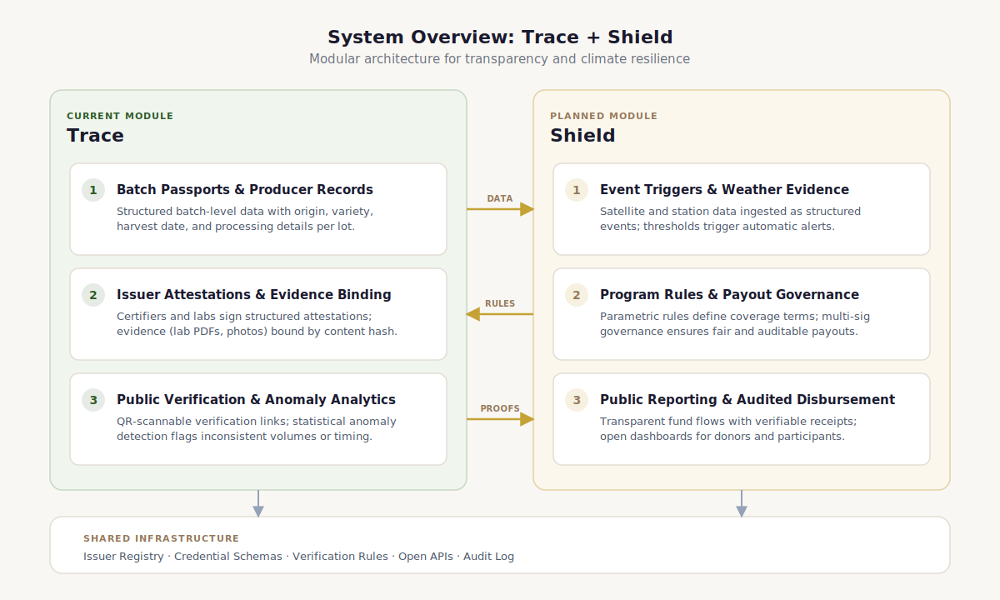
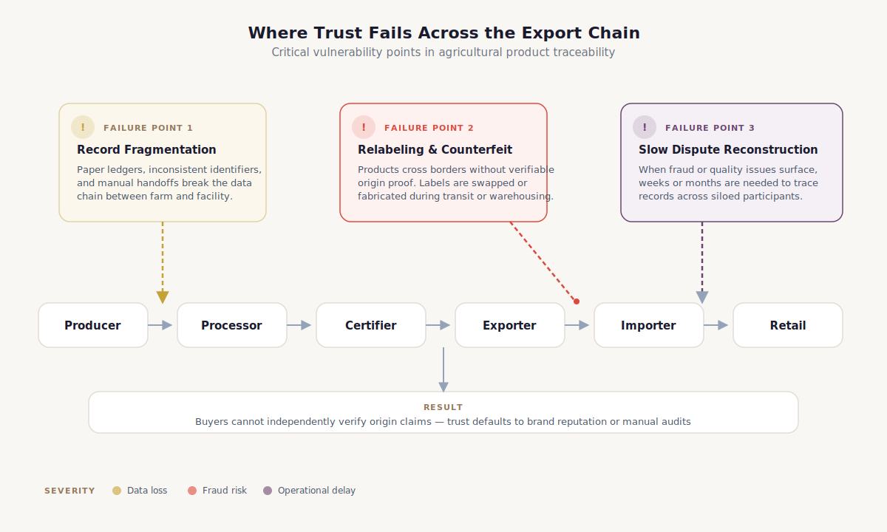
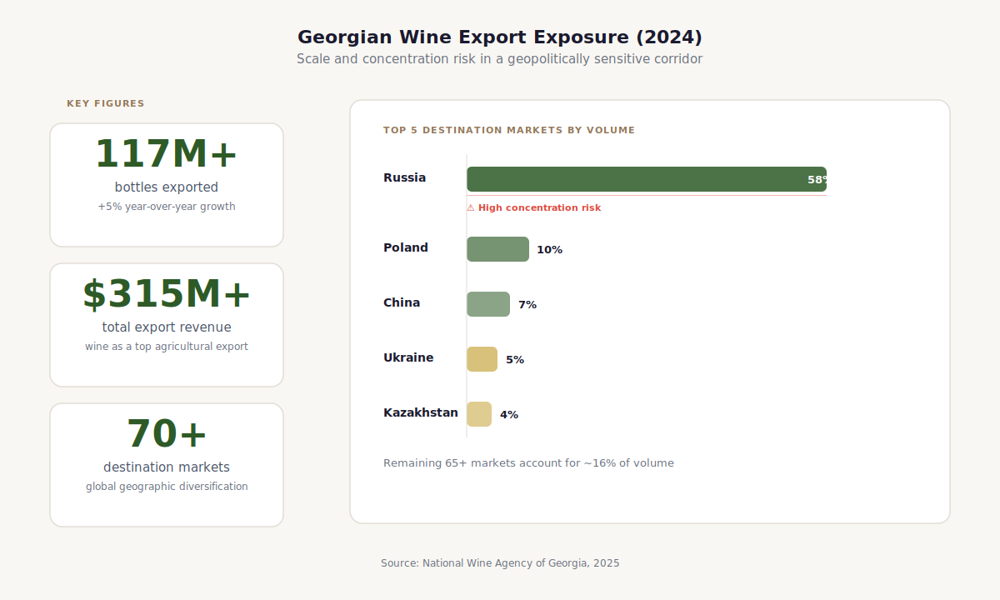
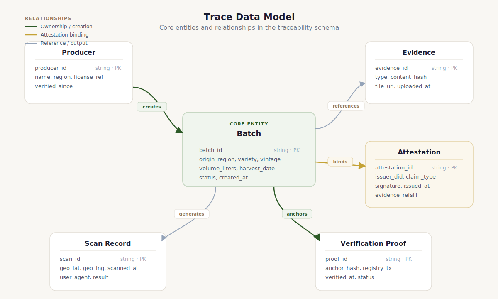
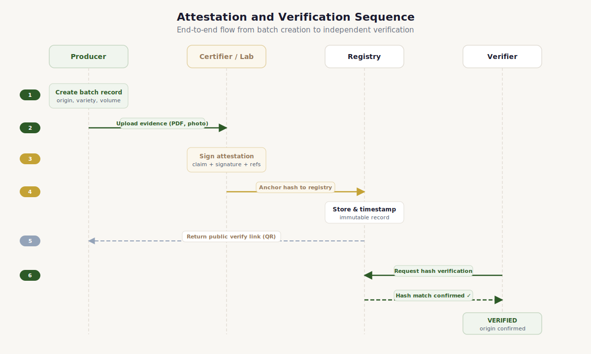
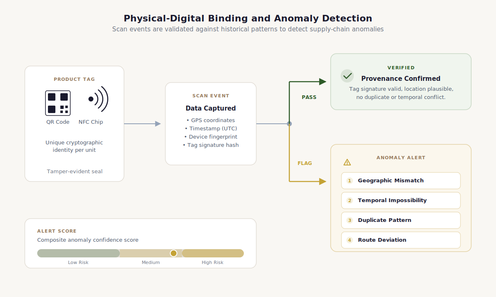
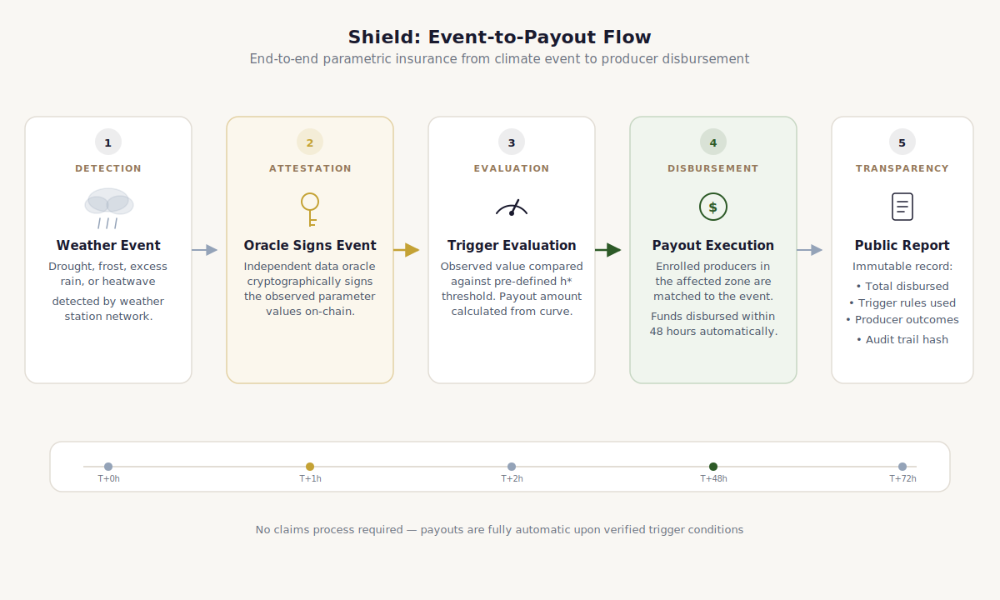
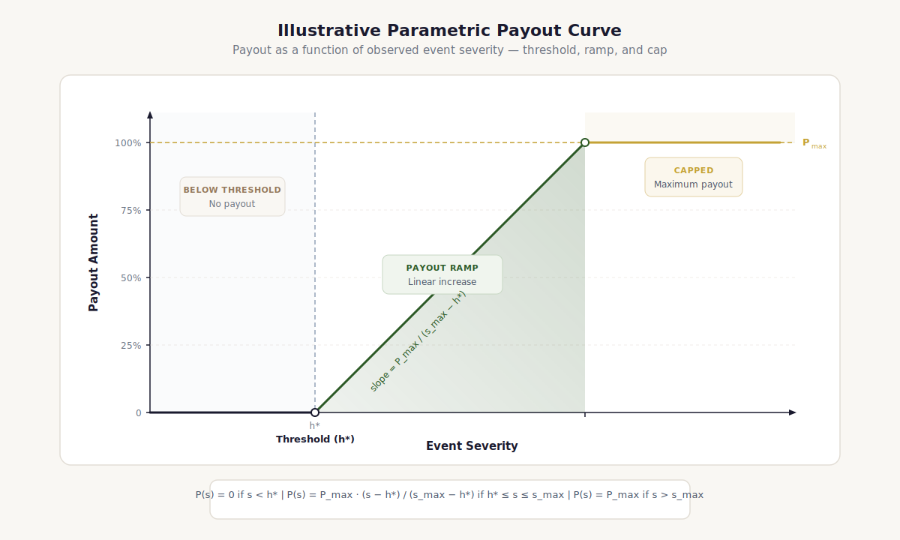
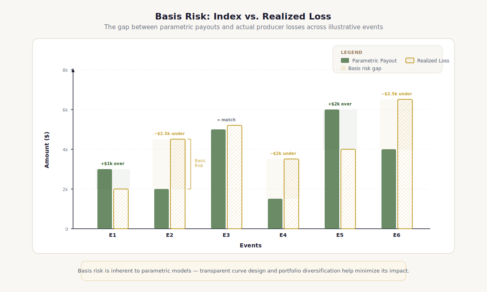
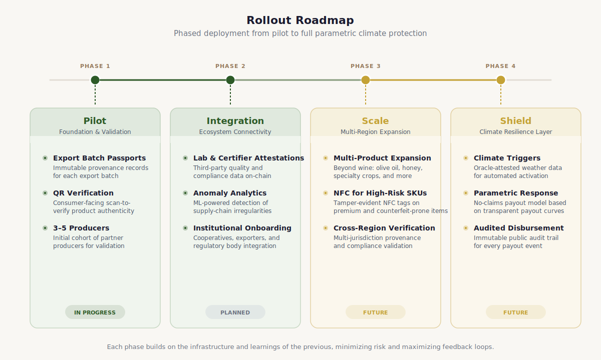

# Terroir: Verifiable Provenance and Climate Resilience Infrastructure for Agricultural Supply Chains

A technical whitepaper for funders, enterprises, and public institutions building shared digital trust for origin-sensitive agricultural products.

[Download PDF](../assets/whitepaper/terroir-trace-shield-whitepaper.pdf)

## Abstract

Terroir is open infrastructure for agricultural supply chains where product value depends on origin. Trace, its first module, creates verifiable batch passports and public verification records backed by multi-party attestations. Shield, the planned second module, extends that same evidence layer into climate-triggered response workflows for smallholder and family-run producers. [^dpg-standard-2025] [^undp-default-open-2024]

The architecture works for any origin-sensitive agricultural product (wine, coffee, olive oil, honey) wherever counterfeiting, fragmented records, and climate exposure converge. Georgia's wine sector is the first pilot because it has everything a test case needs: protected appellations, documented counterfeiting, cross-border exports, and an institutional quality-control system that already produces certifiable evidence. [^nwa-exports-2025] [^sakpatenti-kindzmarauli-2018] [^joss-traceability-2025]

Provenance and resilience belong together. Trace ships first because cross-border trust failure is the most pressing problem. Shield follows once the evidence layer works, because parametric climate response without trusted enrollment and governance just creates disputes. [^worldbank-index-promises-2022] [^joss-traceability-2025]


## Executive Summary

Terroir is open trust and resilience infrastructure for agricultural livelihoods that depend on verified origin. The system is designed to be reusable across product categories and geographies, starting with a focused pilot in Georgian wine. [^dpg-standard-2025] [^undp-default-open-2024]

- Origin-sensitive agricultural products lose value when evidence fragments across borders. Trace solves this with verifiable batch passports and multi-party attestations.
- The architecture is hybrid by design: operational data stays off-chain, cryptographic commitments go on-chain. No blockchain maximalism, no proprietary lock-in.
- Trust tiers distinguish self-reported claims from lab-attested and authority-attested ones. The system is honest about what it knows and who said it.
- Shield extends the same evidence model into climate response. It ships only after Trace is stable, because parametric payouts without trusted enrollment create disputes.
- Open-source governance and DPG alignment are practical adoption strategies, not branding. Cooperatives, agencies, and donor-backed programs need inspectable infrastructure.
[^nwa-exports-2025] [^tifs-blockchain-2021] [^joss-traceability-2025] [^worldbank-index-promises-2022] [^dpg-standard-2025]

### Figure 3. System overview: Trace now, Shield next



Terroir is structured as a layered trust stack. Trace is the current provenance and verification module. Shield is the planned resilience and auditable-response layer built on top of the same issuer, event, and evidence foundations. [^dpg-standard-2025] [^undp-default-open-2024]

!!! note "Module status"
    Trace is current and buildable. Shield is planned and roadmap-grade. They share data primitives, issuer trust, and governance logic, but they are at different maturity levels. This paper treats them accordingly. [^worldbank-viable-solution-2019]


## 1. The Trust Problem in Origin-Sensitive Agriculture

Agricultural products with origin-based value, such as appellations, geographical indications, and single-origin designations, fail in international markets when evidence fails. The product itself might be excellent. But when the records linking it to its place, producer, and handling history fragment across paper certificates, siloed databases, and manual customs checks, counterfeits and relabeled goods slip through. [^oecd-fakes-2022] [^oecd-euipo-fakes-2025]

Climate makes it worse. Hail, frost, drought, and emergency support programs all need to know who was affected, where, under what rules, and how decisions were made. A resilience workflow without auditable evidence is just manual discretion moving faster. A provenance workflow without climate awareness leaves producers exposed to shocks that undermine quality and continuity. [^mepa-hail-aid-2023] [^worldbank-index-promises-2022] [^nature-food-climate-2024]

### Figure 3. Where trust fails across the export chain



The problem is not production; it is maintaining trusted evidence of origin, handling, and authenticity as custody spreads across actors and jurisdictions. [^sakpatenti-kindzmarauli-2018] [^nwa-ukraine-counterfeit-2018]

### Table 4. Problem-to-feature mapping

Trace addresses trust failures first. Shield extends the same trust primitives into climate-response operations once the evidence layer is stable.

| Problem | Operational symptom | Response in Terroir | Module |
| --- | --- | --- | --- |
| Counterfeit origin | Copied labels, ambiguous appellation claims, refill risk | Product passport, issuer attestations, public verify page | Trace |
| Fragmented records | Paper certificates, siloed databases, delayed export checks | Hybrid registry, canonical schemas, open APIs | Trace |
| Weak enforcement evidence | Slow dispute reconstruction across borders | Hash commitments, scan history, attestation chain | Trace |
| Climate shock response delay | Slow assessments, opaque payout decisions, dispute risk | Weather trigger engine, audited relief workflow, public reporting | Shield |
| Youth and smallholder exclusion | Support programs are hard to target and hard to audit | Enrollment records, milestone evidence, transparent disbursement logs | Shield |


## 2. Terroir: What It Is and Why It Exists

Terroir is an open infrastructure layer for agricultural products whose economic value depends on trusted identity. Wine, coffee, olive oil, honey, spices: any product where origin commands a premium and counterfeiting erodes it. Not a marketing tool. A reusable architecture for provenance, verification, and auditable resilience. [^dpg-standard-2025] [^undp-default-open-2024]

!!! note "Why start with Georgian wine"
    Georgia has one of the oldest wine traditions on earth, UNESCO-recognized qvevri practice, hundreds of indigenous grape varieties, a legal GI regime, and documented cross-border counterfeiting cases. More importantly, the state already runs lab workflows, vintage accounting, and quality-control systems that produce real certifiable evidence. Trace plugs into institutions that already issue meaningful data rather than inventing parallel bureaucracy. [^nwa-exports-2025] [^nwa-varietals-2023] [^unesco-qvevri-2013] [^wipo-gi-law-1999] [^nwa-quality-2020] [^sakpatenti-kindzmarauli-2018]

Two layers. Trace is the provenance engine (batch passports, issuer attestations, public verification), ready for pilots now. Shield is the planned resilience extension that uses weather events, eligibility records, and public reporting to make climate-triggered support faster and more auditable. [^worldbank-index-promises-2022] [^rda-agroinsurance-2025]

The economic logic: when a producer exports into a market where origin and quality signaling drive pricing, any ambiguity around authenticity becomes a tax on the honest actor. Some of that shows up as direct counterfeiting. The rest shows up as slower customs clearance, harder distributor onboarding, and more manual disputes. Trace reduces that friction, but only if it respects time. Batch registration at bottling or shipment events, reusable evidence templates, open APIs that don't force downstream partners to change their systems. [^nwa-exports-2025] [^oecd-fakes-2022] [^joss-traceability-2025]

### Figure 5. Georgian wine export exposure in 2024



Official National Wine Agency figures show the scale and cross-border spread of the Georgian wine market, the exact environment in which counterfeit and authenticity disputes become costly. [^nwa-exports-2025]


## 3. Trace: Batch Passports, Attestations, and Verification

Trace creates a digital passport for each batch or export unit. Not a story page, but a structured record linking origin, product type, process details, issuer attestations, and evidence references to a public verification surface accessible through a scan. [^joss-traceability-2025]

Batch-first by design. For most producers, the natural operational unit is the harvest lot, processing batch, or export bundle, not the individual item. Batch-level registration keeps onboarding fast. Higher-risk product lines can layer on item-level tagging later without changing the core model. [^joss-traceability-2025]

### Figure 3. Trace data model



The Trace module binds producer, batch, evidence, attestation, and verification-proof objects into one hybrid record system with selective on-chain commitments.

### Table 4. Source-of-truth matrix by actor and claim type

Terroir works only when claims are assigned to the actors best placed to make them and when higher-trust claims can be distinguished from self-attested claims.

| Claim type | Primary issuer | Evidence artifact | Trust tier |
| --- | --- | --- | --- |
| Harvest and batch creation | Producer or cooperative | Batch record and field evidence | Self-attested |
| Laboratory result | Accredited lab | Signed certificate hash | Lab-attested |
| PDO or GI conformity | Authorized certifier or authority | Inspection or certificate attestation | Authority-attested |
| Export documentation | Exporter and agency workflow | Shipment bundle and document hash | Authority-attested |
| Climate trigger event | Weather oracle and governance signer | Signed event packet and threshold log | Program-attested |

Credibility comes from stratification. A producer self-reports harvest details. A lab signs test results. An authority attests GI conformity. Collapsing all of that into one "verified" badge would be dishonest. Trust tiers make the epistemic weight of each claim visible. [^nwa-quality-2020] [^wipo-gi-law-1999]

### Equation 6. Attestation-weight score

```latex
T = \frac{\sum_i w_i \, a_i}{\sum_i w_i}
```

| Symbol | Meaning |
| --- | --- |
| T | Composite trust score for a batch or claim bundle. |
| w_i | Weight assigned to attestation class i based on issuer credibility and governance rules. |
| a_i | Observed attestation validity or presence for issuer class i. |

The score is not a truth oracle. It is a way to summarize whether a claim is only self-reported or supported by stronger, independent attestations such as labs or authorities. [^joss-traceability-2025]


## 4. Architecture: Hybrid Storage and Public Commitments

Trace uses a hybrid architecture. Operational data (structured records, evidence files, access control) lives in the application layer. Cryptographic commitments, issuer actions, and verification checkpoints live in a minimal public registry that no single operator can silently rewrite. [^tifs-blockchain-2021]

### Equation 2. Trace commitment

```latex
h_{\text{batch}} = \texttt{keccak256}\bigl(\texttt{CanonicalJSON}(\textit{fields})\bigr)
```

| Symbol | Meaning |
| --- | --- |
| h_batch | Batch content hash anchored or stored for verification. |
| CanonicalJSON(batch_core_fields) | Deterministic serialization of the batch fields that define provenance at registration time. |

The batch hash is a compact commitment to the important provenance fields. If any of those fields change later, the verifier recomputes a different hash and the mismatch becomes visible. [^tifs-blockchain-2021]

### Equation 3. Attestation commitment

```latex
h_{\text{att}} = \texttt{keccak256}(\textit{batch\_id} \,\|\, \textit{issuer\_id} \,\|\, \textit{type} \,\|\, \texttt{CanonicalJSON}(\textit{payload}))
```

| Symbol | Meaning |
| --- | --- |
| h_att | Attestation hash stored as the public commitment. |
| batch_id | Identifier of the batch being attested. |
| issuer_id | Credentialed issuer or signer identity. |
| attestation_type | The claim class, such as origin verification or lab result. |
| payload | Structured evidence payload supporting the claim. |

Trace does not anchor raw evidence on-chain. It anchors a cryptographic commitment that links the issuer, the claim type, and the structured payload into one verifiable record. [^tifs-blockchain-2021]

### Equation 4. Verification predicate

```latex
V(\text{batch}) = \mathbf{1}[h^{\text{off}}_{\text{batch}} = h^{\text{on}}_{\text{batch}}] \cdot \prod_i \mathbf{1}[h^{\text{off}}_{\text{att},i} = h^{\text{on}}_{\text{att},i}]
```

| Symbol | Meaning |
| --- | --- |
| V(batch) | Binary verification result for the batch record. |
| 1[...] | Indicator function equal to 1 when the stated condition is true. |
| Π_i | Product over all attestations associated with the batch. |

A batch verifies only when the off-chain batch hash matches the on-chain commitment and every attestation hash also matches its recorded commitment. [^tifs-blockchain-2021]

### Figure 5. Attestation and verification sequence



Trace only needs a small set of on-chain actions. Most operational data stays off-chain, while content hashes and issuer actions remain publicly verifiable.

This avoids two common design failures. Making blockchain the product raises complexity without improving producer outcomes. Keeping everything in a proprietary database kills verification and interoperability. On-chain state handles public commitments. Off-chain data handles operations. Each does what it's good at. [^tifs-blockchain-2021] [^dpg-standard-2025]


## 5. Threats and Tradeoffs

Trace is not a truth machine. Garbage-in is a real risk when only one actor writes decisive claims. The model mitigates this with multiple attestors, source-specific trust tiers, and public verification, not by pretending the system sees everything, but by making visible who said what and when. [^joss-traceability-2025]

QR codes work for low-friction transparency. They don't solve high-adversary anti-counterfeit problems alone. For higher-risk exports, the pattern is QR-first onboarding, secure NFC for selected SKUs, and anomaly analytics that flag impossible behavior, such as the same tag scanned in two countries the same week, or hundreds of scans from a warehouse that shipped ten cases. [^sakpatenti-kindzmarauli-2018] [^oecd-euipo-fakes-2025]

### Figure 3. Physical-digital binding and anomaly detection



QR is sufficient for low-friction transparency. Higher-risk export lines can add secure NFC and duplicate-scan logic without changing the core attestation model.

### Equation 4. Scan anomaly score

```latex
A(\text{tag}) = w_1 v_{\text{geo}} + w_2 v_{\text{time}} + w_3 v_{\text{dup}} + w_4 v_{\text{route}}
```

| Symbol | Meaning |
| --- | --- |
| A(tag) | Risk score associated with a specific QR or NFC tag. |
| v_geo | Geographic inconsistency feature, such as impossible distance between scans. |
| v_time | Temporal inconsistency feature. |
| v_dup | Duplicate or repeated scan pattern intensity. |
| v_route | Mismatch between observed and expected distribution path. |

Anomaly scoring does not prove fraud by itself. It helps brand owners, importers, and authorities prioritize which suspicious events deserve review. [^sakpatenti-kindzmarauli-2018] [^oecd-euipo-fakes-2025]


## 6. Shield: Parametric Resilience and Audited Response

Shield is planned, not launched. It turns documented climate events into faster, more auditable support decisions by reusing the enrollment, evidence, and verification logic that Trace already establishes. [^mepa-hail-aid-2023] [^worldbank-index-promises-2022]

### Figure 2. Shield event-to-payout flow



Shield is designed as a planned resilience layer: weather data enters a trigger engine, oracles sign event claims, payout rules resolve against enrolled vineyard records, and results are publicly reported without exposing personal identities. [^mepa-hail-aid-2023] [^rda-agroinsurance-2025] [^worldbank-index-promises-2022]

### Equation 3. Shield trigger indicator

```latex
\text{Trigger} = \mathbf{1}[H \geq h^* \;\lor\; F \leq f^* \;\lor\; T_{\min} \leq t^*]
```

| Symbol | Meaning |
| --- | --- |
| H | Observed hail or hazard intensity for the covered area. |
| F | Observed frost condition indicator. |
| T_min | Minimum temperature in the relevant event window. |
| h*, f*, t* | Governance-approved thresholds for the program. |

Shield uses transparent threshold rules so participants know in advance what event levels are sufficient to move a case into the payout workflow. [^worldbank-index-promises-2022] [^worldbank-viable-solution-2019]

### Equation 4. Illustrative payout rule

```latex
P_i = \min\bigl(P_{\max},\; \text{Area}_i \cdot \max(0,\; \alpha(H - h^*) + \beta(F - f^*) + \gamma(D - d^*))\bigr)
```

| Symbol | Meaning |
| --- | --- |
| P_i | Payout for participant i. |
| P_max | Program cap for a single enrolled unit. |
| Area_i | Covered area or another exposure measure for participant i. |
| alpha, beta, gamma | Weights for hail, frost, and drought index components. |
| D | A drought or dryness indicator where relevant to the program. |

The formula illustrates a transparent structure rather than a final actuarial contract. It shows how exposure, threshold exceedance, and capped support can be combined without hiding logic inside manual discretion. [^worldbank-index-promises-2022] [^worldbank-viable-solution-2019]

### Figure 5. Illustrative parametric payout curve



A threshold, ramp, and cap keep the mechanism interpretable and auditable. The curve is illustrative rather than a production actuarial schedule. [^worldbank-index-promises-2022] [^worldbank-viable-solution-2019]

The hard problem is basis risk, the gap between what a parametric index says happened and what a producer actually lost. A fast index-based response improves speed and auditability, but it can diverge from real local damage. Shield should start as rapid relief with clear thresholds, published rules, and fallback review paths. Not as an insurance market replacement. [^worldbank-index-promises-2022] [^worldbank-viable-solution-2019] [^nature-food-climate-2024]

### Equation 7. Basis risk measure

```latex
\text{BR} = \mathbb{E}\bigl[|L_i - P_i|\bigr]
```

| Symbol | Meaning |
| --- | --- |
| BR | Expected basis risk over observed cases. |
| L_i | Realized loss for participant i. |
| P_i | Program payout for participant i. |
| E | Expectation across cases or seasons. |

Basis risk is the expected gap between real damage and parametric payout. Shield should make that gap visible and governable rather than pretending it disappears. [^worldbank-index-promises-2022] [^worldbank-viable-solution-2019]

### Figure 8. Basis risk as the core design constraint



The gap between realized loss and index payout is the central governance and design problem for Shield. That gap must be visible, measured, and monitored. [^worldbank-index-promises-2022] [^worldbank-viable-solution-2019]


## 7. Governance and Safeguards

Provenance infrastructure can't be governed as a black box. If Terroir supports producers, agencies, certifiers, and donor-backed programs, its schemas, verification logic, and upgrade path need to stay inspectable and contestable. Open-source licensing and DPG-style governance are structural requirements, not a branding exercise. [^dpg-standard-2025] [^undp-default-open-2024]

GI protection is a legal and institutional matter. Terroir accelerates evidence handling and verification, but it doesn't imply that a technical record replaces protected-designation law or formal enforcement. Funding-sensitive audiences also need strict separation between rural-livelihood infrastructure and anything that looks like product promotion. [^wipo-gi-law-1999] [^wipo-geneva-act-2025] [^unicefusa-gift-policy-2026]

### Built-in safeguards

- No personal farmer data or beneficiary-identifying financial details published on-chain.
- No youth-targeted marketing, gamified features, or product-promotion mechanics in the core system.
- Child-labor and safe-work commitments handled as governance attestations, not promotional badges.
- Shield publishes totals, event logic, and rule execution without exposing sensitive participant records.
[^unicefusa-gift-policy-2026] [^dpg-standard-2025]


## 8. Rollout

Start with one exporter-facing Trace pilot on a small set of high-value SKUs. Prove that batch registration, issuer attestations, and public verification work inside real production and export workflows without adding unacceptable friction. [^nwa-exports-2025]

Once the evidence model stabilizes, bring in institutional integrations (labs, certifiers, associations, agencies) that contribute stronger attestations. Only then pilot Shield in a bounded climate-response program. Resilience logic depends on trusted enrollment, traceable evidence, and transparent rules. Rushing it creates exactly the disputes it's designed to prevent. [^rda-agroinsurance-2025] [^dpg-standard-2025]

### Figure 3. Rollout roadmap



The proposed rollout starts with batch passports for export SKUs, then layers in issuer integrations, anomaly analytics, and finally the forthcoming Shield resilience workflow.


## 9. Conclusion

Terroir treats provenance, certification, and climate response as parts of one shared evidence system rather than disconnected compliance tasks. The position is technically defensible, economically relevant, and well matched to how origin-sensitive agricultural supply chains actually break. [^nwa-exports-2025] [^joss-traceability-2025]

Trace starts where the pain is sharpest: cross-border trust failure for products whose value depends on verified origin. Shield extends the same primitives into climate resilience without pretending governance disappears into code. The architecture is specific enough to ship in one geography and general enough to scale across product categories. [^dpg-standard-2025] [^undp-default-open-2024] [^worldbank-index-promises-2022]

Success should be measured at the operational level, not by technical throughput. Share of export batches with verified passports. Median time for a producer to register a batch. Duplicate-scan alert rates and resolution speed. Once Shield ships, median days from climate trigger to payout decision. These tell you whether the system is actually reducing friction for the people it claims to serve. [^joss-traceability-2025] [^worldbank-index-promises-2022] [^dpg-standard-2025]


## Appendix: Formula Notes and Implementation Glossary

CanonicalJSON is a deterministic serialization rule: sort keys, strip whitespace, render values consistently before hashing. The point is reproducibility across software stacks. [^tifs-blockchain-2021]

In Shield, the symbols h*, f*, and t* are governance-approved threshold values, not secret actuarial parameters. Publishing them is part of the transparency model. The same applies to payout caps, program windows, and trigger-classification logic. [^worldbank-index-promises-2022] [^worldbank-viable-solution-2019]

Trust tiers should display as readable labels (Self-attested, Lab-attested, Authority-attested), not as a single undifferentiated verified badge. That distinction matters for institutional adoption and public honesty. [^joss-traceability-2025] [^nwa-quality-2020]


## References

[^dpg-standard-2025]: Digital Public Goods Alliance. (2025). DPG Standard. https://www.digitalpublicgoods.net/standard/ [Source](https://www.digitalpublicgoods.net/standard/)
[^undp-default-open-2024]: United Nations Development Programme. (2024). Default to open. https://www.undp.org/publications/default-open [Source](https://www.undp.org/publications/default-open)
[^nwa-exports-2025]: National Wine Agency of Georgia. (2025, January 20). Record revenues from wine and spirits exports. https://wine.gov.ge/En/News/38181 [Source](https://wine.gov.ge/En/News/38181)
[^sakpatenti-kindzmarauli-2018]: National Intellectual Property Center of Georgia (Sakpatenti). (2018, August 9). Counterfeit wine labeled with appellation of origin 'Kindzmarauli' revealed in Russia. https://www.sakpatenti.gov.ge/en/news/5309/ [Source](https://www.sakpatenti.gov.ge/en/news/5309/)
[^joss-traceability-2025]: Banstola, A., Ghimeray, A. K., & Ahmad, T. (2025). Do farmers participate in traceability systems? A systematic review and future directions. Journal of the Science of Food and Agriculture, 105(4), 2036-2049. https://onlinelibrary.wiley.com/doi/10.1111/joss.70034 [Source](https://onlinelibrary.wiley.com/doi/10.1111/joss.70034)
[^worldbank-index-promises-2022]: World Bank. (2022). Index insurance for agricultural resilience: Promises, challenges and solutions. https://openknowledge.worldbank.org/entities/publication/1be2d7c8-9b22-5753-bf07-4a0df44bc09d [Source](https://openknowledge.worldbank.org/entities/publication/1be2d7c8-9b22-5753-bf07-4a0df44bc09d)
[^tifs-blockchain-2021]: Paliwal, V., Chandra, S., & Sharma, S. (2021). Blockchain technology for sustainable supply chain management: A systematic literature review and a classification framework. Trends in Food Science & Technology, 109, 637-660. https://doi.org/10.1016/j.tifs.2021.08.012 [Source](https://doi.org/10.1016/j.tifs.2021.08.012)
[^worldbank-viable-solution-2019]: World Bank. (2019). Is index insurance a viable solution for disaster risk financing in agriculture? https://openknowledge.worldbank.org/entities/publication/e6cc66f4-a4b3-5355-bded-ef17f4f9d4b3 [Source](https://openknowledge.worldbank.org/entities/publication/e6cc66f4-a4b3-5355-bded-ef17f4f9d4b3)
[^oecd-fakes-2022]: Organisation for Economic Co-operation and Development. (2022). Global trade in fakes: A worrying threat. OECD Publishing. https://www.oecd.org/en/publications/global-trade-in-fakes-a-worrying-threat_74c81154-en.html [Source](https://www.oecd.org/en/publications/global-trade-in-fakes-a-worrying-threat_74c81154-en.html)
[^oecd-euipo-fakes-2025]: Organisation for Economic Co-operation and Development, & European Union Intellectual Property Office. (2025). Mapping global trade in fakes 2025: Global trends and enforcement challenges. OECD Publishing. https://doi.org/10.1787/94d3b29f-en [Source](https://doi.org/10.1787/94d3b29f-en)
[^mepa-hail-aid-2023]: Ministry of Environmental Protection and Agriculture of Georgia. (2023, November 17). More than 5,800 vineyard owners received state assistance after hail damage in Kakheti. https://mepa.gov.ge/Ge/News/Details/21399 [Source](https://mepa.gov.ge/Ge/News/Details/21399)
[^nature-food-climate-2024]: Moriondo, M., Ferrise, R., Dibari, C., and colleagues. (2024). Climate resilience pathways for European wine regions. Nature Food, 5, 551-562. https://www.nature.com/articles/s43016-024-00988-w [Source](https://www.nature.com/articles/s43016-024-00988-w)
[^nwa-ukraine-counterfeit-2018]: National Wine Agency of Georgia. (2018, December 31). Counterfeit Georgian wine batch removed from sale in Ukraine. https://wine.gov.ge/En/News/25735 [Source](https://wine.gov.ge/En/News/25735)
[^nwa-varietals-2023]: National Wine Agency of Georgia. (2023, June 6). The 8,000-year-old uninterrupted tradition of wine production in Georgia. https://wine.gov.ge/En/News/37074 [Source](https://wine.gov.ge/En/News/37074)
[^unesco-qvevri-2013]: UNESCO. (2013). Decision of the Intergovernmental Committee: Traditional Georgian winemaking method in qvevri. https://ich.unesco.org/en/decisions/8.COM/8.13 [Source](https://ich.unesco.org/en/decisions/8.COM/8.13)
[^wipo-gi-law-1999]: World Intellectual Property Organization. (1999). Law of Georgia on appellations of origin and geographical indications of goods. WIPO Lex. https://www.wipo.int/wipolex/en/text/217274 [Source](https://www.wipo.int/wipolex/en/text/217274)
[^nwa-quality-2020]: National Wine Agency of Georgia. (2020). Annual report 2020. https://wine.gov.ge/En/Files/Download/12996 [Source](https://wine.gov.ge/En/Files/Download/12996)
[^rda-agroinsurance-2025]: Rural Development Agency. (2025). Agroinsurance. https://www.rda.gov.ge/en/projects/Agroinsurance [Source](https://www.rda.gov.ge/en/projects/Agroinsurance)
[^wipo-geneva-act-2025]: World Intellectual Property Organization. (2025, February 25). Georgia strengthens the protection of its geographical indications. https://www.wipo.int/web/wipo-magazine/articles/georgia-strengthens-the-protection-of-its-geographical-indications-67406 [Source](https://www.wipo.int/web/wipo-magazine/articles/georgia-strengthens-the-protection-of-its-geographical-indications-67406)
[^unicefusa-gift-policy-2026]: UNICEF USA. (2026). Gift acceptance policy. https://www.unicefusa.org/about/finances-and-accountability/gift-acceptance-policy [Source](https://www.unicefusa.org/about/finances-and-accountability/gift-acceptance-policy)
